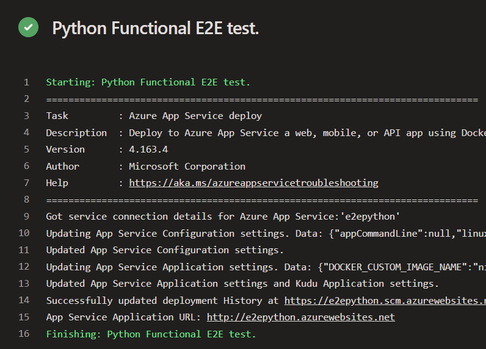

# Functional Tests
Functional tests deploy a bot to Azure, tests it, then deletes it.

To deploy a bot to Azure, we use yaml files to set up a pipeline in Azure DevOps.

## Summary
* Across the repos there seems to be mainly only 1 functional test: send a message, get an echo, using Direct Line client.
* Dotnet tests more channels than the other repos, with each channel putting a little twist on the send-message-receive-echo format. 
    * For example Direct Line Speech sends and receives messages with audio, Twilio sends/receives SMS, etc.
* Additionally dotnet has a few token tests (getting access token from credentials, as well as from refresh token)
* The tests listed in the section below are automated
* We seem to have a few bots that are in our SDK that can be run manually that do not have any automate tests attached:
    * dotnet: skills
    * js: skills with SSO
___

## Dotnet
List of Pipelines, what yaml files they call, test files called, and finally what tests the files run.

[Dotnet Functional Test Pipelines in Azure DevOps](https://fuselabs.visualstudio.com/SDK_v4/_build?view=folders&treeState=XERvdE5ldCRcRG90TmV0XEZ1bmN0aW9uYWxUZXN0cw%3D%3D)

* Botbuilder-DotNet-Facebook-Functional-Tests-yaml
    * `botbuilder-dotnet-ci-facebook-test.yml`
        * `FacebookChatTests.cs`
* BotBuilder-DotNet-Functional-Tests-Windows-yaml
    * `botbuilder-dotnet-functional-test-windows.yml`
        * TestCategory: **FunctionalTest**
            * `DirectLineClientTests.cs`
                * Send a message to bot, should receive a message response back (that isn’t “welcome”). Almost identical to Skills Functional Tests
            * `DirectLineSpeechTests.cs`
                * Voice message input to bot  => Voiced echo output
            * `FacebookChatTests.cs`
                * Send a message to Facebook, receive echo from Facebook
            * `GetTokenRefreshTests.cs`: 
                * Can get token from credentials (e.g. `MicrosoftAppCredentials.GetTokenAsync()`)
                * Can get an access token using a refresh token
                * Load testing the refresh token (get a token 1000 times)
            * `JwtTokenExtractorTests.cs`
                * null required endorsements should fail
                * Empty array of endorsements should validate
                * Should be able to validate endorsements, if endorsements are present
            * `SlackClientTest.cs`: Send a message to Slack, receive echo from Slack
* BotBuilder-DotNet-Functional-Tests-Linux-yaml
    * `botbuilder-dotnet-functional-test-linux.yml`
        * Test: same tests as we run in windows (see BotBuilder-DotNet-Functional-Tests-Windows-yaml pipeline)
* BotBuilder-Dotnet-Slack-Functional-Tests-yaml
    * `botbuilder-dotnet-ci-slack-test.yml`
        * `SlackClientTest.cs`

* Twilio -- we have Twilio tests written, but we don't seem to have a pipeline built for the tests. I can't remember where I encountered it, but I saw a line "somewhere" saying that there was issues with permissions or licensing...?? Anyways, it appears the result is that we have intentionally stopped running Twilio functional tests

*Note*: All the test yamls call `ci-build-steps.yml`

## JS
List of pipelines and tests.
For JS, the builds/pipelines use a combination of yaml files, inline defined in DevOps, and custom commands written in package.json of SDK.

* Run-JS-Functional-Tests-BrowserBot-yaml
    * `browser-tests-build-ci.yml`
        * Can't figure out what test files it's pointing to (it uses `nightwatch` and that's as deep as I can go) -- in DevOps I can see the tests being run, but no idea where they're defined...
        * Uses custom commands:
            * `run browser-functional-test chrome`
            * `run browser-functional-test firefox`
* Run-JS-Functional-Tests-Windows
    * Deploys `functionaltestbot`and runs custom npm command
        * `"functional-test": "lerna run build && nyc mocha \"libraries/functional-tests/tests/*.test.js\""`
            * `directLine.test.js`
                * Send a message, get an echo message back

The following Pipelines follow the same build as the Windows pipeline (see Run-JS-Functional-Tests-Windows)
* Run-JS-Functional-Tests-Linux
* Run-JS-Functional-Tests-Linux-Gov (never ran in DevOps)
* Run-JS-Functional-Tests-Windows-Gov (never ran i DevOps)

And I think `dialogToDialog` folder is never called in a build...appears to have no code?
* 

## Python
* BotBuilder-Python-Functional-Tests-Linux-yaml
    * `botbuilder-python-functional-test-linux.yml`
        * `functionaltestbot/app.py` (this is confusing...this is the bot itself, not a test file like `tests/test_py_bot.py`)
            * In DevOps it doesn't appear to be executing any tests either (or perhaps I'm misreading?):
            * 
* remaining python pipelines don't point to functional tests (just unit tests for CI that run when PRs are made)

## Java
None (Only pipelines for CI and daily)

## Skills
Glorious 4x4 test matrix!!! :bowtie: :star2: :heavy_check_mark:
___

## Related Content
* [Pipelines in Azure DevOps](https://fuselabs.visualstudio.com/SDK_v4/_build?treeState=XERvdE5ldCRcRG90TmV0XEZ1bmN0aW9uYWxUZXN0cw%3D%3D&view=folders)
* [Bot Framework SDK Product Pipelines Overview](https://github.com/microsoft/botframework-sdk/blob/master/specs/BotFrameworkSdkPipelinesOverview.md)